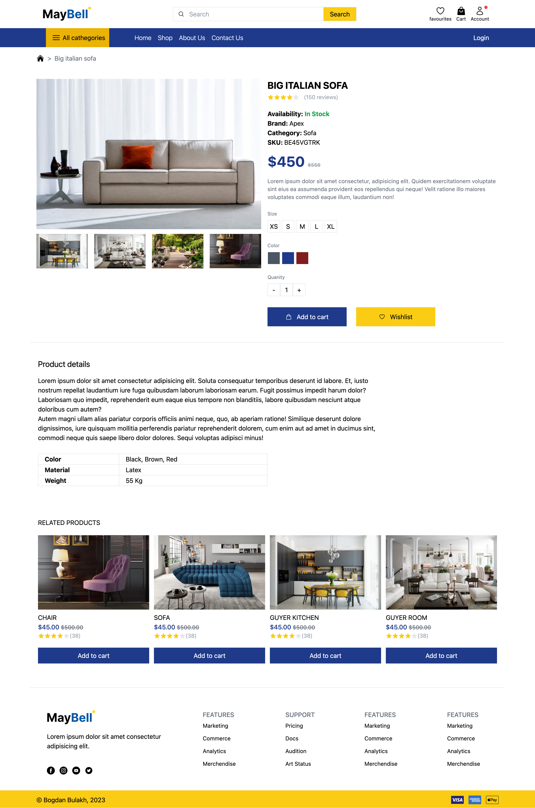

# Tailwind e-commerce layout

Simple online furniture store webpage made by using TailwindCSS

### Pages Preview:

<strong>Homepage</strong>

<strong>Catalog</strong>

<strong>Product overview</strong>

  
### About project:

Project includes 3 pages of ecommerce shop: main page, product overview and a catalog

- Fully responsive;
- Self-designed;
- Grid layouts and Flexbox modules were used.
